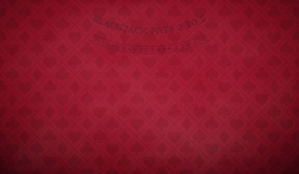

# Blackjack

A professional, high-fidelity Blackjack game built with web technologies, featuring intuitive gameplay and a polished user interface.

## Description
Blackjack is a web-based implementation of the classic casino card game. It offers a realistic gaming experience with smooth animations, sound effects, and a complete chips management system. The project focuses on clean code architecture and responsive design, providing a seamless experience across different devices.

## Detailed Overview
This project was developed to showcase modern front-end capabilities using vanilla JavaScript. It implements the standard rules of Blackjack, where the player aims to reach a hand value of 21 or higher than the dealer without busting. The game includes sophisticated logic for betting, card dealing, and dealer artificial intelligence, all within a visually engaging environment.

## Features
- Complete Blackjack rules (Hit, Stand, Double Down, Split)
- Realistic chips and betting system
- Dynamic card animations and sound effects
- Dealer AI following standard casino rules
- Responsive UI for desktop and mobile play
- Session-based score and balance tracking

## Technologies Used
- HTML5
- CSS3 (Custom styles and animations)
- Vanilla JavaScript (ES6+)

## Installation Instructions
1. Clone the repository:
   ```bash
   git clone https://github.com/SzntiDev/Blackjack.git
   ```
2. Navigate to the project directory:
   ```bash
   cd Blackjack
   ```
3. Open `index.html` in your preferred web browser.

## Usage Examples
To start playing:
1. Select your bet amount using the chips.
2. Click "Deal" to receive your cards.
3. Choose to "Hit" for another card or "Stand" to keep your current hand.
4. The dealer will then play their turn according to the rules.

## Project Structure
- `index.html`: Main game structure and entry point.
- `programa.js`: Core game logic, including card handling and dealer AI.
- `Estilos.css`: Styling and animations for the game interface.
- `img/`: Directory containing card images, chips, and UI assets.

## Configuration
No additional configuration is required. The game runs entirely in the browser using local resources.

## API Documentation
Not applicable for this project.

## Screenshots or Examples


## Roadmap / Future Improvements
- Multi-hand support
- Online multiplayer capabilities
- Advanced statistics and leaderboards
- Customizable table themes

## Contributing Guidelines
Contributions are welcome! Please fork the repository and submit a pull request with your proposed changes.

## License
MIT License

---

# Blackjack (Español)

Un juego de Blackjack profesional de alta fidelidad construido con tecnologías web, con una jugabilidad intuitiva y una interfaz de usuario pulida.

## Descripción
Blackjack es una implementación web del clásico juego de cartas de casino. Ofrece una experiencia de juego realista con animaciones fluidas, efectos de sonido y un sistema completo de gestión de fichas. El proyecto se centra en una arquitectura de código limpia y un diseño responsivo.

## Resumen Detallado
Este proyecto fue desarrollado para demostrar las capacidades del front-end moderno utilizando JavaScript puro. Implementa las reglas estándar del Blackjack, donde el objetivo del jugador es alcanzar un valor de mano de 21 o superior al del crupier sin pasarse. El juego incluye lógica sofisticada para apuestas, reparto de cartas e inteligencia artificial del crupier.

## Características
- Reglas completas de Blackjack (Pedir, Plantarse, Doblar, Dividir)
- Sistema realista de fichas y apuestas
- Animaciones dinámicas de cartas y efectos de sonido
- IA del crupier siguiendo las reglas estándar de los casinos
- Interfaz responsiva para escritorio y móviles
- Seguimiento de puntuación y saldo basado en la sesión

## Tecnologías Utilizadas
- HTML5
- CSS3 (Estilos y animaciones personalizadas)
- Vanilla JavaScript (ES6+)

## Instrucciones de Instalación
1. Clonar el repositorio:
   ```bash
   git clone https://github.com/SzntiDev/Blackjack.git
   ```
2. Navegar al directorio del proyecto:
   ```bash
   cd Blackjack
   ```
3. Abrir `index.html` en tu navegador web preferido.

## Ejemplos de Uso
Para empezar a jugar:
1. Selecciona tu monto de apuesta usando las fichas.
2. Haz clic en "Repartir" para recibir tus cartas.
3. Elige "Pedir" para otra carta o "Plantarse" para mantener tu mano actual.
4. El crupier jugará su turno según las reglas.

## Estructura del Proyecto
- `index.html`: Estructura principal del juego y punto de entrada.
- `programa.js`: Lógica central del juego, incluyendo manejo de cartas e IA del crupier.
- `Estilos.css`: Estilos y animaciones para la interfaz del juego.
- `img/`: Directorio que contiene imágenes de cartas, fichas y activos de la interfaz.

## Configuración
No se requiere configuración adicional. El juego se ejecuta completamente en el navegador.

## Documentación de la API
No aplicable para este proyecto.

## Capturas de Pantalla o Ejemplos


## Hoja de Ruta / Mejoras Futuras
- Soporte para múltiples manos
- Capacidades de multijugador en línea
- Estadísticas avanzadas y tablas de clasificación
- Temas de mesa personalizables

## Guía para Contribuir
¡Las contribuciones son bienvenidas! Por favor, haz un fork del repositorio y envía un pull request con los cambios propuestos.

## Licencia
Licencia MIT
